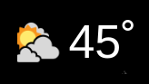
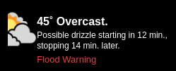
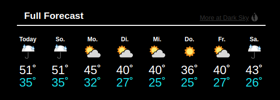
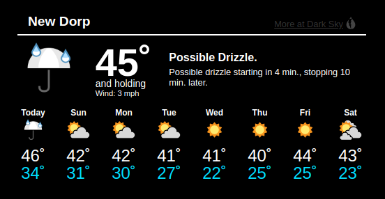
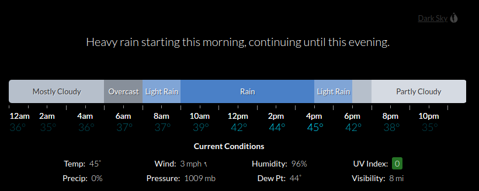
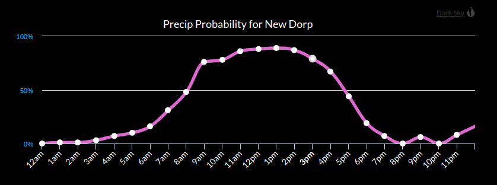

## MMM-PLOW

#### *** Pig Latin On Weather! ***

* Driven by the Darksky API yet you don't need an API key!

## Examples

#### Minimal view - (config style: "default-small",)

-

#### Minimal plus current conditions - (config style: "small",)

-

#### 7 day forecast - (config style: "default",)

-

#### 7 day forecast w/ current conditions - (config style: "default",)

-

#### Hourly bar graph w/ current conditions - (config style: "graph-bar",)

-

#### Temp, Precip, Humidity, Wind, Pressure, UV and Visibility line graphs


-

#### Multiple instances by simply adding more config entries

-

## Attention!

* Not all config options apply to every style

## Installation

* `git clone https://github.com/mykle1/MMM-PLOW` into the `~/MagicMirror/modules` directory.

## Config.js entry and options

```
{
disabled: false,
module: 'MMM-PLOW',
position: 'middle center',
config: {
  languages: "en",                          // en, de, es, fr, it, nl, ar, zh, x-pig-latin
  style: "default",                         // See Style list in readMe
  latLong: "40.683,-74.9708",               // Your latitude and longitude seperated by a comma
  title: "New Dorp",                        // Location seems logical
  tempUnits: "C",                           // F or C
  textColor: "00dfff",                      // Hex color codes. No # symbol
  font: "default",                          // See font list in readMe
  htColor: "ffffff",                        // high temp color. Hex color codes. No # symbol
  ltColor: "00dfff",                        // low temp color. Hex color codes. No # symbol
  displaySum: "yes",                        // Display Summary, yes or no
  displayHeader: "yes",                     // yes or no
  timeColor: "ffffff",                      // when style is graph-bar. Hex color codes. No # symbol
  tempColor: "00dfff",                      // when style is graph-bar. Hex color codes. No # symbol
  currentDetails: "true",                   // when style is graph-bar. true or false
  graphType: "precip_graph",                // when style is graph. See readMe
  lineColor: "dd66cf",                      // when style is graph. No # symbol
  markerColor: "ffffff",                    // when style is graph. No # symbol
  animationSpeed: 3000,
  updateInterval: 10 * 60 * 1000,
   }
},
```

## Language List

* English = en
* Deutsch = de
* Spanish = es
* French = fr
* Italian = it
* Nederlands = nl
* Arabic = ar
* Chinese = zh
* Pig Latin = x-pig-latin

## Style list

* small
* default-small
* default
* graph_bar
* graph

## Font List

* Default
* Trebuchet MS
* Georgia
* Times New Roman
* Arial
* Verdana
* Palatino
* Serif
* Sans Serif

## My unending gratitude to sdetweil and cowboysdude

* Thank you, my friends!
