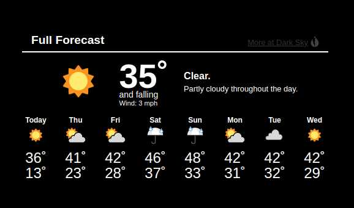
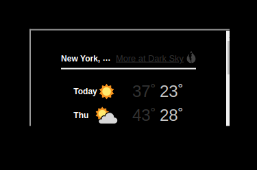

## MMM-WWX

### Under construction

## Should look like this :-)



## Currently displays like this :-(



## Installation

* `git clone https://github.com/mykle1/MMM-WWX` into the `~/MagicMirror/modules` directory.

## Config.js entry and options

```
{
disabled: false,
module: 'MMM-WWX',
position: 'middle center',
config: {
    latLong: "40.683,-74.9708", // Your latitude and longitude seperated by a comma
    tempUnits: "us", // us = F - uk = C
    color: "FFFFFF", // Hex color codes
    font: "Default",  //
              }
          },
```
