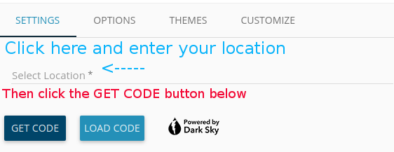
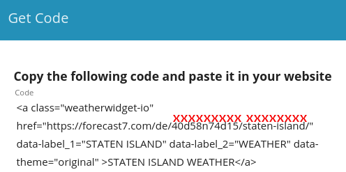

## MMM-WWX

#### *** Weather Widgets Xtreme! ***

* Driven by the Darksky API yet you don't need an API key!

## Examples

#### Minimal view - (config style: "default-small",)


#### Minimal plus current conditions - (config style: "small",)


#### 7 day forecast - (config style: "default",)


#### 7 day forecast with current conditions - (config style: "default",)


#### Hourly bar graph with or without current conditions - (config style: "graph-bar",)


#### Temp, Precip, Humidity, Wind, Pressure, UV and Visibility line graphs - (config style: "graph" and config graphType: "wind_graph",)


#### Multiple instances by simply adding more config entries


## Installation

* `git clone https://github.com/mykle1/MMM-WWX` into the `~/MagicMirror/modules` directory.

## Config.js entry and options


```
{
disabled: false,
module: 'MMM-WWX',
position: 'middle center',
config: {
   languages: "es",                          // en, de, es, fr, it, nl, ar, zh, x-pig-latin
   style: "responsive",                      // See Style list
   latLong: "40.683,-74.9708",               // Your latitude and longitude seperated by a comma
   title: "New Dorp",                        // Location seems logical
   tempUnits: "us",                          // us = F - uk = C
   textColor: "00dfff",                      // Hex color codes. No # !!!
   font: "default",                          // See font list
   htColor: "ffffff",                        // high temp color. Hex color codes. No #
   ltColor: "00dfff",                        // low temp color. Hex color codes. No #
   displaySum: "yes",                        // Display Summary, yes or no
   displayHeader: "yes",                     // yes or no
   timeColor: "ffffff",                      // for graph-bar. Hex color codes. No #
   tempColor: "00dfff",                      // for graph-bar. Hex color codes. No #
   currentDetails: "true",                   // for graph-bar. Hex color codes. No #
   graphType: "precip_graph",                // when style is graph
   lineColor: "dd66cf",                      // when style is graph
   markerColor: "ffffff",                    // when style is graph
   //  when style: "responsive" only ///////////////////////////////////
   height: "200px",                          // when style is responsive
   width: "1200px",                          // when style is responsive
   location: "staten-island",                // See instructions for location when style is responsive
   locationCode: "40d58n74d15",              // See instructions for locationCode when style is responsive
   label: "New Dorp",                        // when style is responsive
   label2: "Staten Island",                  // when style is responsive
   days: "7",                                // when style is responsive *** 3, 5 or 7 ***
   theme: "random_grey",                                // dark or random_grey
   /////////////////////////////////////////////////////////////////////
   animationSpeed: 3000,
   updateInterval: 10 * 60 * 1000,
   }
},
```

## Config style list

* small
* default-small
* default
* graph_bar
* graph
* responsive


## Attention!

* Not all config options apply to every style

## Font List

* Default
* Trebuchet MS
* Georgia
* Times New Roman
* Arial
* Verdana
* Palatino
* Serif
* Sans Serif

## Language List

* English = en
* Deutsch = de
* Spanish = es
* French = fr
* Italian = it
* Nederlands = nl
* Arabic = ar
* Chinese = zh
* Pig Latin = x-pig-latin

## Instructions for location and locationCode when using config style: "responsive",

* Go to https://weatherwidget.io/

#### Follow these directions


#### And follow these directions, too.

#### The locationCode and location you need are under the red xxxxxxxxxx's. Enter those in config


## My unending gratitude to sdetweil and cowboysdude

* Thank you, my friends!
